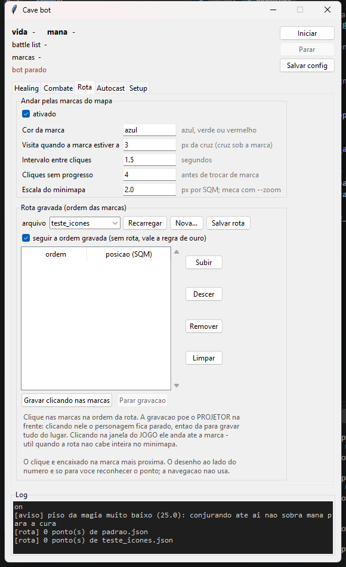

# tibia_obs_bot

Cave bot para Tibia que **lê a tela pelo projetor do OBS** e manda teclas e
cliques para o cliente. Cura, poção de mana, ataque com combo de magia, autocast
e rota pelas marcas do mapa — tudo por um painel.



## Por que o OBS

A janela do Tibia devolve **preto** em captura de janela: o cliente desenha pela
GPU e usa BattlEye, e nenhum dos caminhos comuns (`PrintWindow`, `BitBlt`) vê o
conteúdo. A saída é abrir um **projetor** no OBS ("Captura de jogo" → botão
direito na fonte → Projetor em janela) e ler os pixels dele.

O arranjo em uso:

1. o projetor fica *sempre visível*, mostrando o jogo;
2. a janela do Tibia fica **na frente e transparente** (`python opacity.py 1`),
   recebendo teclas e cliques;
3. o bot lê do projetor e escreve no jogo.

Se o jogo abrir preto, veja *Problemas conhecidos* no fim.

## Instalação

```
pip install mss numpy pyautogui pygetwindow keyboard
python gui.py
```

Windows apenas: o posicionamento de janelas, a opacidade e o clique usam
`user32` direto.

## Como usar

1. abra o Tibia e o **projetor** do OBS, maximizado, na mesma resolução;
2. `python opacity.py 1` deixa a janela do jogo transparente;
3. `python gui.py` abre o painel. `Iniciar` põe o foco no jogo e começa;
4. `Ctrl+Alt+S` para a qualquer momento, mesmo sem foco.

Clicar no painel tira o foco do jogo e o bot pausa sozinho — é proposital,
serve de freio de mão.

### Abas

| aba | o que tem |
| --- | --- |
| Healing | vida/mana máximas, cura, cura de emergência, poção de mana |
| Combate | como lutar (stand/chase/kite), tecla de atacar, kite, combo de magia, lista de monstros |
| Loot | ir no corpo e clicar, tecla de saque, fila de corpos |
| Rota | marcas do mapa, rota gravada, tecla de parar de andar |
| Autocast | até 4 teclas em intervalo fixo (pá, comida, buff) |
| Setup | título do projetor, tecla de parada, intervalo do loop |

### Loot

`ENABLE_LOOT`, na aba **Loot** — aba própria, porque saquear não é parte de como
lutar: acontece **depois** da briga e é **igual** em stand, chase e kite. O modo
de luta muda de onde se parte, não o que se faz com o corpo.

**O bot não anda atrás do corpo: ele dá UM clique em cima dele.** No cliente,
clicar num corpo — perto ou longe — já é a ordem de ir até ele e abrir: o
próprio cliente acha o caminho. O bot chegava a cliques, um passo por leitura, e
em caçada isso apareceu como *"clicou nele e depois clicou mais duas vezes à
frente"*: com a odometria um quadrado atrás, os cliques seguintes caem **adiante**
do corpo e o personagem passa direto.

O gesto tem duas metades e nada entre elas:

1. **um clique** em cima do quadrado do corpo, e nunca um segundo na mesma
   aproximação;
2. **a tecla de saque**, que age sobre o quadrado debaixo do cursor e só alcança
   corpo ao lado ou em cima — sai junto com o clique se já estava colado, ou
   sozinha quando o personagem chega.

A única coisa que autoriza um clique novo naquele corpo é a **briga cancelar a
caminhada**: a tecla de parar solta todas as ações no cliente, e isso inclui o
trajeto que o clique tinha pedido. O bot detecta isso pelo buraco na contagem de
leituras — se ele deixou de cuidar deste corpo por algumas leituras, foi lutar.

**E o clique sai na leitura da MORTE.** O quadrado do corpo é guardado em
coordenada de mundo e reconvertido pela odometria toda vez que se olha para ele,
e a odometria deriva; na leitura da morte a conversão é a identidade — o
quadrado saiu daquela mesma leitura. Clicar depois é clicar num quadrado que
envelheceu, e foi o que apareceu como *"errou os dois targets que matou por um
SQM, e não looteou"*.

Isso também é o que faz valer **mata, saqueia, ataca o próximo**: enquanto o
saque só valia para corpo colado, o bicho morto a 2 SQM esperava a briga inteira
— *"matou o primeiro e não foi lootear, depois continuou atacando sem lootear"*.
Agora qualquer corpo **dentro da tela** é clicado na hora, e a tecla de atacar
espera uma leitura. Um corpo por leitura: dois cliques na mesma leitura mandam
duas caminhadas e só a última vale.

O preço, assumido: corpo longe faz o cliente andar durante a briga. Um clique
num corpo é um *usar*, não é a ordem de movimento que troca *chase* por *stand*,
mas a caminhada que ele provoca é movimento. Apanhando (`LOOT_ANTES_HP_MIN`),
revidar vem primeiro.

Fora da área do jogo não existe quadrado para clicar e o corpo é largado. O
clique de minimapa que assumia ali dependia de `MINIMAP_PX_SQM` — um número que
se mede à mão com `--zoom` e que muda com o zoom do jogo —, e era a origem do
*"vai na direção certa mas passa a mais muitas vezes"*. Medido: com
`MINIMAP_PX_SQM` em 1, 2 ou 4, o clique cai **no mesmo pixel**.

O gesto cabe numa frase: **chegar no corpo e clicar nele com o botão direito.**
No Tibia o direito sobre um corpo saqueia — sabendo que clicou nele, está feito,
e não há o que conferir depois. O esquerdo só manda o personagem andar para lá.
Um clique, um ponto, e o corpo sai da fila.

Depois do clique sai **uma** apertada da tecla de saque (`LOOT_TECLA`, padrão
`-`), no mesmo ponto e só **colado** no corpo — ao lado ou em cima
(`LOOT_TECLA_DIST`). É reforço para o caso de o clique não ter saqueado, não um
segundo gesto: no cliente o saque exige adjacência, enquanto o clique direito
vale a qualquer distância visível. Vazio desliga. E ela manda também a gêmea do numpad (`LOOT_TECLA_NUMPAD`), porque o `-`
de cima não é o `-` do numpad — `VK_OEM_MINUS` contra `VK_SUBTRACT`. O bot
apertava uma enquanto a hotkey do cliente estava na outra, e o log não acusava,
porque do lado dele a tecla saía com sucesso.

**O que foi removido é a varredura**, não a tecla. Ela apertava em nove
quadrados, com o cursor pulando de um para outro, para cobrir o erro de 1 SQM do
palpite de odometria. Varrer é chutar: clique ou tecla em quadrado sem corpo não
saqueia nada, e clique direito em chão vazio ainda abre menu de contexto.

**O corpo está onde uma barra de vida desapareceu.** Este é o sinal principal, e
vem de um fato do cliente: bicho morto perde a barra de vida e o nome, sobrando
só a sprite do cadáver. Então o quadrado que tinha barra e não tem mais é, por
definição, onde ele caiu.

É diferença de **conjuntos**, não de pixels: a resposta é "sumiu" ou "não sumiu",
sem limiar para calibrar nem empate para desfazer. E usa o mesmo detector que o
bot já usa para achar criatura — a moldura de 31×4 da barra, medida na tela.

Isso substituiu a comparação de imagem como fonte primária, e os números de uma
caçada real explicam por quê: ela media **14 contra 12** (limiar 12), **16 contra
12**, **17 contra 17**. O vencedor mal passava do limiar e mal passava do
segundo, e punha corpo a 2, 3 e 5 SQM num modo *stand* corpo a corpo, onde todo
corpo tem de estar a 1. Os únicos saques que davam certo eram os que saíam a
1 SQM por acidente.

A comparação de imagem ficou como **reserva**, para quando nenhuma barra sumiu na
tela — o bicho morreu fora dela, ou a leitura de referência não o pegou. O log
diz qual dos dois decidiu.

**O desaparecimento é anotado na leitura em que acontece**, e não procurado
depois. A barra some no *instante* da morte, mas a morte só é confirmada
`TARGET_GONE_READS` leituras depois — e nesse meio-tempo outro bicho pode pisar
no quadrado do corpo. Ali passa a haver barra de novo, e comparar a leitura de
referência com a de agora concluiria que **nada sumiu**. Medido: com um intruso
em cima do corpo, a comparação tardia perde o sinal por completo; o registro no
instante devolve o quadrado certo.

O registro é em coordenada de **mundo** (odômetro + offset), porque o personagem
se move entre a morte e o saque — offset guardado já envelheceu duas vezes neste
projeto. A comparação tardia continua existindo como reserva, para quando a
barra nunca foi vista sumir.

**Mas barra que sumiu não é sempre morte.** Ela deixa de estar num quadrado por
três motivos, e só um interessa:

| o que aconteceu | a barra | a battle list |
|---|---|---|
| morreu ali | some | a entrada sai |
| **andou** um quadrado | some do velho, **aparece** no novo | não muda |
| **saiu da tela** | some, na **borda** | a entrada sai |

Tratar os três como morte foi o estrago medido em caçada: *"o bot acerta o
clique exatamente no corpo dele porém dá mais alguns cliques e passa do
monstro"*. Os cliques a mais eram cliques de **andar**, atrás de corpos que não
existiam — o registro estava cheio de quadrado de onde um bicho apenas tinha
dado um passo, e a morte consumia "o desaparecimento mais recente", que sai de
uma iteração de **conjunto**: ordem arbitrária. Medido à parte, em 5 arranjos de
briga: 4 acertavam por sorte de *hash* e 1 apontava o quadrado de um passo.

A peneira usa o que está na própria leitura, sem limiar:

1. **a battle list tem de ter encolhido.** Ninguém saiu da lista, ninguém
   morreu: barra que sumiu ali é passo, ou uma leitura em que a detecção
   piscou. (Vale uma leitura de folga, porque lista e tela são duas capturas.)
2. **passo é explicado por uma barra nova a 1 SQM.** Bicho anda um quadrado por
   vez.
3. **desaparecimento na borda da tela** é bicho que foi embora.

E quando as contas não fecham — mais desaparecimentos do que barras novas para
explicá-los, ou mais candidatos do que entradas que saíram da lista — o bot
**não chuta**: diz no log que não sabe qual foi passo e qual foi morte, e larga
aquele corpo. Perder um loot custa um loot; chutar custa clique em quadrado
errado, uma caminhada para lugar nenhum e o personagem passando do monstro.

Numa briga de melee todo mundo está a 1 SQM de todo mundo, então isso acontece
de verdade: se dois bichos dão um passo na mesma leitura em que o terceiro
morre, "A morreu e B andou" e "B morreu e A andou" descrevem as duas leituras
igualmente bem, e nenhuma conta de posição decide. Medido: das três mortes,
duas caem em leitura limpa e são pegas; a confusa se perde, sem inventar
quadrado nenhum.

**A reserva por imagem também não entra depois de leitura ambígua.** Ela compara
imagem de quadrado, e o quadrado de onde um bicho saiu **andando** fica chão
puro — que é justamente o que "mudou mais" desde que havia bicho ali. Medido:
com três barras se mexendo na leitura da morte, ela marcou o quadrado de um
bicho **vivo**, e o bot foi clicar e andar para lá.

**A leitura de referência é a última em que ele ainda constava da lista**, achada
pela **contagem de entradas** e não por um número fixo de leituras atrás. Era
`historico[-(TARGET_GONE_READS + 1)]` — um chute. Com bicho sobrevivente na
lista, o histórico continua enchendo depois da morte e o chute caía no lugar
certo por coincidência; com **um bicho só** ele para de crescer quando a lista
esvazia, e o chute caía quatro leituras antes da morte — 0,6 s mais o *debounce*,
tempo de sobra para o bicho andar. O bot ia buscar o corpo onde o bicho fora
**engajado**, não onde morreu.

A contagem resolve sem chute: a leitura em que ele ainda constava é a última com
**mais entradas do que agora**. Medido com o bicho andando de (4,0) até (1,0) e
morrendo ali: com a regra antiga o bot marcava (4,0), o lugar do engajamento; com
a nova, (1,0).

**A troca de alvo é uma morte, e ela apagava a suspeita.** Numa caverna se mata
em grupo, e a cada morte o cliente passa a moldura vermelha para o próximo bicho
sem que a battle list fique vazia. A trava de alvo acusava a queda na contagem de
entradas e, na **mesma leitura**, substituía o sprite rastreado pelo do novo
alvo — a suspeita pendente era destruída antes de poder fechar. Só a **última**
morte da briga era confirmada, porque é a que esvazia a lista. Medido em
isolamento, com quatro bichos e a moldura passando adiante: **zero de quatro**
mortes detectadas.

Os dois sinais chegam juntos e bastam sozinhos: a moldura passou para outro bicho
**e** o que se atacava não está mais na lista. Não há o que esperar — a morte é
declarada ali, antes de o sprite rastreado ser substituído.

E mais dois estragos na **história de leituras** (`bichos_vistos`), que é a
referência da comparação de imagem:

- **rejeitar um bicho pelo filtro apagava a história.** Ela é compartilhada por
  todos os bichos, não é de um: apagar deixava as mortes seguintes sem
  referência. Agora o filtro descarta apenas o ponto de morte **daquele** bicho;
- **`if historico:` governava o bloco inteiro**, inclusive o registro de barras
  que sumiram — que não depende dela para nada. História vazia, nenhum corpo
  marcado, mesmo com o quadrado exato da morte já anotado. O registro do instante
  passa a valer sozinho, e a comparação de imagem continua sendo a reserva.

Era esse conjunto que produzia "com três para saquear e um sem, ele vai só no
último". Depois: três corpos marcados, em três quadrados distintos, e o
desmarcado filtrado.

O que substituiu a varredura: **o corpo é identificado na tela.** O quadrado onde o
bicho estava **muda** quando ele morre (sprite de bicho → sprite de corpo), e o
quadrado vizinho que nunca teve bicho continua igual. Quem mudou é onde caiu.

Não é reconhecimento de sprite de cadáver — isso mudaria de espécie para espécie
e precisaria de uma tabela por bicho, com um passo de aprendizado. É "este
quadrado ficou diferente", que vale para qualquer bicho, inclusive um que o bot
nunca viu.

A comparação usa o quadro **mais recente** em que o bicho ainda constava da
battle list. A janela de quadros para de crescer quando a lista esvazia, então o
último item é o instante logo antes de ele **sair da lista** — a posição mais
fresca e, para comparar a tela, o quadro mais perto no tempo, com menos coisa
tendo mudado por outro motivo.

Medido em cenário sintético: corpo aparecendo muda **16,7** por pixel, chão
parado **0,0**, chão inteiro trocado (o pior caso de água/fogo) **10,1**. Daí
`LOOT_DIFF_MIN = 12`.

**Não decidir não vira não agir.** Quando nenhum quadrado muda o bastante, o bot
cai no palpite da odometria e clica **um** ponto — ainda um clique, num lugar só.
Ligar `LOOT_SO_SE_ACHOU` faz ele largar o corpo nesses casos, e isso já custou
loot: com limiares calibrados em cenário sintético, "não decidiu" é o caso comum
e não a exceção, porque a sprite do bicho é maior que um quadrado e o vizinho
também muda. Empate entre dois quadrados também não é ignorância — dois
quadrados mudando muito significa que há corpo por ali —, então o desempate é
pelo mais perto do palpite (`LOOT_DIFF_MARGEM` decide o que conta como empate).

Os números reais aparecem no log de cada morte (`mudou N por pixel, segundo M`)
— é por eles que se calibra o limiar na sua caverna, já que os meus vêm de
cenário sintético. E os de uma caçada de verdade foram reveladores: **14 contra
12**, **16 contra 12**, **39 contra 37**. O vencedor mal passa do limiar e mal
passa do segundo, ou seja a comparação de tela quase não decide nada numa
caverna real — o que faz o desempate pelo palpite ser a decisão de fato, e é bom
que seja, porque o palpite é uma posição **medida** de barra de vida, não uma
diferença no meio do ruído.

**O `--kite` calibra `CREATURE_BAR_ABOVE` sozinho.** O bot converte a posição da
barra de vida no quadrado da criatura somando essa constante; errada por um,
**toda** posição sai errada por um quadrado em y e o loot clica ao lado. No log
daquela caçada, o palpite e a escolha discordavam sempre em y, sempre por 1,
nunca em x — a assinatura exata desse erro.

Não há por que adivinhar o valor: o personagem está **sempre** no quadrado do
meio da tela, e o cliente desenha barra sobre ele. Passada pela mesma conversão,
a barra dele tem de cair em `(0, 0)`; caindo em `(0, -1)`, a constante está um a
menos. O `--kite` mede isso a cada leitura e no fim diz o valor a usar.

**Um clique, e só um** — e a tecla de saque **colada nele**, sem nada no meio.
O primeiro clique direito no corpo abre a bolsa, e ela aparece *sobre* a área do
jogo: um segundo clique no mesmo pixel cai na janela que o primeiro abriu, e ali
ele é clique direito num item — menu de contexto, que fica na frente e engole a
tecla. Isso já foi a opção `LOOT_CLIQUES`; ela sobrou valendo 2 numa config
salva, e era exatamente o clique a mais.

Depois da tecla sai um `esc` (`LOOT_FECHA_MENU`): sem *classic control* o clique
direito abre menu de contexto, que fica na frente e engole o que vier depois. Ele
ficava **antes** da tecla, o que é a ordem errada: entre clicar no corpo e
apertar o `-` não pode haver nada.

**A fila é de vários corpos** (`LOOT_MAX_CORPOS`): mata-se o grupo todo e depois
se recolhe. Duas mortes no mesmo quadrado contam como uma. Fazer isso funcionar
custou três consertos, todos encontrados por um teste que roda o laço com três
bichos idênticos morrendo um a um:

- **a morte no meio da briga não era detectada.** A conta de "uma entrada
  desapareceu da lista" ficava depois do `return` do caso engajado, e por isso
  não rodava durante a luta. A cada morte o cliente passa a moldura para o
  próximo sem a lista esvaziar, o bot sobrescrevia o sprite rastreado em
  silêncio, e só a **última** morte da briga era registrada. A conta é por
  *contagem* de entradas iguais, não por identidade — três bonelords têm o mesmo
  sprite, então não se sabe *qual* morreu, mas se sabe que um morreu;
- **a contagem era refrescada com queda pendente**, apagando a suspeita antes da
  confirmação: caía de 3 para 2, a leitura seguinte adotava 2 como o novo normal
  e a morte nunca fechava;
- **a referência da comparação de tela era o quadro mais recente.** Com um bicho
  só isso funcionava por acidente (o histórico para de crescer quando a lista
  esvazia); com sobrevivente na lista ele continua enchendo, e "o mais recente"
  passa a ser *depois* da morte — diferença zero, nada identificado. Agora é o
  quadro de `TARGET_GONE_READS + 1` leituras atrás.

Depois disso o bot ainda saqueava **só um** numa briga de verdade. Faltavam três
coisas, e as duas primeiras só apareciam com os bichos **colados** — que é como
eles morrem, porque estavam todos batendo em você:

- **corpos a 1 SQM de distância eram fundidos num só.** A fusão existia para
  "dois bichos morreram no mesmo quadrado", mas a tolerância era de 1 SQM
  inteiro. Medido: `(1,0)` e `(1,1)` viravam um corpo; `(1,0)` e `(2,0)` também.
  Dois bichos lado a lado, um loot. Agora fusão é **mesmo quadrado**, e nada
  menos;
- **o histórico da comparação era apagado a cada morte**, deixando a morte
  seguinte da mesma briga sem quadro antigo com que comparar — a janela
  recomeçava do zero e "o quadro de antes" virava o de agora. A janela já tem
  tamanho fixo, que é o que impede leitura velha de sobrar;
- **duas entradas que somem na mesma leitura eram um corpo.** A morte é
  confirmada `TARGET_GONE_READS` leituras depois de a entrada sumir, e dois
  bichos morrendo nesse intervalo — o grupo todo com pouca vida, o caso normal —
  somem juntos. A contagem já sabia que foram dois; faltava marcar um quadrado
  para cada.

E a busca deixou de ser um anel em volta de um palpite: ela cobre **os quadrados
onde havia bicho** na leitura de referência. O palpite é sempre o bicho mais
perto, e com empate de distância sempre o mesmo dos três — o corpo dos outros,
a 4 SQM, ficava fora do alcance da busca. O corpo está onde um bicho estava de
pé, e a lista de criaturas daquela leitura diz exatamente onde cada um estava.

**O corpo é guardado em coordenada absoluta do odômetro, não em offset.** O corpo
não anda: quem anda é o personagem, e offset guardado envelhece a cada passo.
Corrigir esse envelhecimento a cada leitura foi a origem de dois bugs seguidos.
Posição absoluta não precisa de correção: a conta é sempre a mesma subtração.

**Quando saquear: a pergunta certa é distância, não tempo.** O que troca *chase*
por *stand* no cliente é uma **ordem de movimento** — tecla de direção ou clique
no mapa. Clique direito num corpo é um "usar", não um andar. Daí:

- **corpo colado** (`LOOT_NA_HORA`): saqueia **na hora**, mesmo com bicho vivo em
  volta. Não envolve andar, e ganha a posição mais fresca que existe — sem risco
  de o corpo sair da tela, sem deriva de odometria, sem fila para percorrer
  depois. Em kite isso importa: o bot se afasta dos bichos, então se afasta do
  corpo, e um corpo fora da área do jogo é largado;
- **corpo longe**: fica na fila. Chegar nele exige clique no mapa, que é
  movimento e leva o personagem para dentro do que sobrou da briga.

**A ordem é: mata um, saqueia, ataca o próximo** (`LOOT_ANTES_DE_ATACAR`). Com
corpo ao alcance esperando, a tecla de atacar espera — engajar o próximo primeiro
empurra o saque para depois da briga inteira. A espera é curta por construção: só
vale para corpo **ao alcance**, que se resolve num clique sem sair do lugar, e na
prática o saque acontece na mesma leitura da morte, antes do ataque. Corpo longe
não segura nada. E apanhando (vida abaixo de `LOOT_ANTES_HP_MIN`), revidar vem
primeiro.

Uma consequência: o `esc` de fechar menu **não sai durante a briga**. Ele para
todas as ações no cliente — solta o alvo engajado e, em kite, corta o passo de
fuga. Com briga em andamento, um menu de contexto aberto é o menor dos males.

**Mas esperar a battle list VAZIA travava o saque para sempre** quando um bicho
fugia da tela: a entrada dele não sai da lista enquanto ele estiver vivo, e o
corpo do que morreu envelhecia no chão até vencer `LOOT_VALIDADE`. Tirado de um
log de caçada:

```
[loot] bicho morreu a -4,-5 SQM; 1 corpo(s) na fila
[kite] 1 na battle list e nenhum bicho na tela: correu para fora do alcance
```

O corpo foi marcado certo e o saque nunca aconteceu. As três razões de esperar
valem para bicho **perto**, não para entrada na lista: um bicho fora da tela está
a mais de 7 SQM de lado ou 5 de altura — não alcança o personagem e não está
sendo atacado. Agora o que segura o saque é **bicho na tela ou alvo engajado**, e
o log diz quando libera com entrada ainda na lista. A rota continua exigindo a
lista limpa de verdade: saquear o corpo do lado não puxa monstro, mas sair
andando o cave com bicho na lista puxa.

**O prazo conta o tempo TENTANDO CHEGAR**, e não o relógio de parede. Ele já
contou da morte, e uma briga de três bichos condenava os dois últimos: eles
morrem no mesmo instante e o prazo deles vencia enquanto o primeiro era
saqueado. Medido: de três corpos na fila, um era largado sem receber um clique.

Contar da primeira tentativa foi melhor e continuava errado do mesmo jeito, e
apareceu em caçada: *"tá indo saquear mas se encontra outro bicho ele para e
ataca, não continua o saque"*. **Briga no meio do caminho não é tempo tentando
chegar.** Parar e lutar está certo — clique no mapa troca *chase* por *stand* no
cliente, e parado em cima do corpo com bicho do lado o personagem apanha de
graça. O errado era o prazo correr durante a briga inteira e o corpo ser
descartado ao voltar. Medido: corpo **a 2 SQM** largado com `desisto dele`, sem
nunca ter recebido um clique.

O que se soma é o tempo entre leituras **consecutivas** em que o bot esteve
naquele corpo. Briga no meio abre um buraco na contagem de leituras, e buraco
não entra na soma — é contagem de leituras, não um limiar de segundos para
calibrar. Depois: os dois corpos saqueados, nenhuma desistência.

Passado `LOOT_VALIDADE` desde a morte o corpo é largado sem tentativa — ele
ficou para trás na rota. Esse continua no relógio de parede, de propósito: é o
fim de linha, não o prazo da tentativa.

Não pegou nada na caçada? Dois diagnósticos, para perguntas diferentes:

- `python main.py --corpo` mostra a **corrente**: para o bot saber onde caiu o
  corpo, a entrada na battle list e a barra de vida na tela do jogo têm de
  aparecer na **mesma leitura**. Ele conta as leituras e diz qual é o elo fraco.
- `python main.py --loot` confere o **clique**, com um corpo do lado: botão,
  geometria da tela, e como ler cada resultado.

### Saquear só alguns monstros

**Atacar e saquear são escolhas separadas.** O bot continua atacando o que sempre
atacou; a lista de monstros (aba Combate) diz de quem vale pegar o corpo:
**clique na coluna `$`** para marcar ou desmarcar. `LOOT_SO_MARCADOS` — a
caixinha *saquear só os marcados* — liga o filtro.

A lista é um `Treeview` e não um `Listbox` justamente por causa disso: `Listbox`
não tem coluna, então a escolha virava um `$` no meio do texto mais um botão
separado para alternar o selecionado — duas etapas para uma decisão de um
clique, e um símbolo a explicar. Com coluna, o clique sabe onde caiu e a caixa
alterna sozinha. Clicar no **nome** não alterna nada: escolher um monstro para
renomear não pode mudar o saque dele sem querer.

Isso importa em dois casos concretos: a caverna tem bicho de loot bom e bicho que
só dá lixo, e cada corpo custa uma parada (e, se estiver longe, uma caminhada); e
com o auto-aprendizado ligado **todo** bicho novo entra na lista, virando mais
uma viagem.

Como o bot sabe quem morreu: a trava de alvo guarda o **sprite** do bicho que
sumiu da battle list, e `monstros.json` liga sprite a nome — o mesmo critério de
igualdade do resto (diferença média **ou** correlação), que é o que aguenta o
sprite escurecido do bicho quase morto.

**E a comparação ignora a borda do recorte.** O sprite que a trava guarda é do
bicho **engajado**, e no alvo o cliente desenha uma moldura vermelha que faz
parte do recorte; os sprites da lista costumam vir de uma linha **sem** moldura.
Medido no sprite real de uma caçada:

| moldura | diferença média | correlação | casa? |
|---|---|---|---|
| 1 px | 16,2 (limiar 12) | 0,574 (limiar 0,90) | **não** |
| 2 px | 29,8 | 0,424 | não |
| só o interior | — | — | **sim** |

Uma moldura de **um pixel** fazia o bicho deixar de casar com o próprio sprite
guardado, e o log dizia `bicho nao reconhecido` no meio de uma lista em que ele
estava — o corpo de quem **estava** marcado era ignorado. A moldura não é parte
do monstro (`MONSTER_BORDA_ALVO`), e a segunda tentativa compara só o interior.

Duas decisões de borda, ambas para não tirar nada de quem não pediu:

- **filtro desligado saqueia todos**, e é o padrão;
- o `monstros.json` aceita as **duas formas** — `"Bonelord": [[...]]` (só o
  sprite, vale como "saqueia") e `{"sprite": [...], "loot": false}`. Lista
  escrita antes de existir esse interruptor continua saqueando tudo. E salvar a
  lista por outro motivo (aprender um sprite, renomear) **preserva** as escolhas:
  não pode religar o loot de ninguém pelas costas.

Com o filtro ligado, **bicho não reconhecido fica de fora** — marcar só faz
sentido se o que não foi marcado ficar de fora.

**Limitação conhecida:** com vários bichos na tela, o palpite inicial é o do mais
perto na leitura em que a lista ainda o tinha. A identificação na tela corrige o
palpite errado; com dois bichos morrendo ao mesmo tempo em quadrados diferentes
ela dá empate e o bot larga, em vez de chutar.

### Como lutar: stand, chase ou kite

`ATTACK_MODE`, na aba Combate. O cliente tem o modo de luta dele nos botões; o
que se escolhe aqui é o que **o bot** faz enquanto luta:

| modo | o bot |
| --- | --- |
| `stand` | manda a tecla de parada ao engajar e não sai do lugar |
| `chase` | **não** manda a tecla de parada — o `esc` cancelaria o follow do cliente junto com o ataque. Só para de clicar no mapa e deixa o cliente perseguir |
| `kite` | anda de seta para ficar **sempre** a `KITE_DIST` SQM do bicho mais perto: recua se ele chega, **persegue se ele corre** |

No kite, o bot acha as criaturas pela **moldura da barrinha de vida** que o
cliente desenha sobre cada uma. Medida na captura de dentro da cave, ela é
assim:

```
###############################     <- 31 px de preto puro
#VVVVVVVVVVVVVVVVVVVVVVVVVVVVV#     <- 2 linhas de preenchimento colorido
#VVVVVVVVVVVVVVVVVVVVVVVVVVVVV#
###############################     <- preto puro nas quatro bordas
```

Procurar só "faixa fina e saturada" **não serve** no viewport: ali há textura,
efeito de magia e item por tudo, e o bot dizia ver 42, 90, até 202 criaturas na
tela. Exigindo a moldura preta em cima, embaixo e nas duas pontas, sobram só as
barras de verdade. A moldura **não encurta** com o dano — só o preenchimento —
então a detecção funciona igual com o bicho quase morto, que é justamente quem
está perto. A barra de vida **e a de mana** do próprio personagem caem no
quadrado do meio do viewport e são descartadas.

A distância tem **dois lados**. Perto demais é perigo; longe demais é perder o
bicho. A nota de cada posição é, em ordem: está na distância ou mais → o quanto
desvia da distância → a soma das distâncias **em linha reta**. Esse terceiro
nível não é detalhe: o Tibia mede distância pelo maior eixo, e por essa conta
sair de (1,0) para (1,1) não melhora nada — continua colado. Em linha reta
melhora, e é esse passo que no seguinte abre de verdade. Sem ele o bot ficava
plantado quando o único lado que aumentava a distância estava bloqueado por
escada. O desempate vale só quando está perto demais: na distância certa ele
fica parado, senão andaria em círculo por centésimos de diagonal.

### Bicho que corre

Fechar 6 quadrados de seta são 6 teclas a `KITE_COOLDOWN` cada, e cada seta
esbarra sozinha em cada pedra do caminho — era por isso que ele demorava a ir
atrás de quem fugia. A partir de `KITE_DIST + KITE_CLIQUE` de distância o bot
**clica no mapa**: anda o trecho inteiro com o desvio de parede do próprio
cliente, e o clique é calculado para parar exatamente a `KITE_DIST` do bicho. De
perto ele volta para a seta, que é o que dá controle fino.

Isso vale só no modo kite: ali as setas já forçam *stand* no cliente, então o
clique não troca modo de luta nenhum.

**O clique tem de terminar.** Clique no mapa é um trajeto inteiro, e clicar de
novo no meio dele **cancela** o anterior: clicando a cada `KITE_COOLDOWN` o
personagem re-rotava sem parar e andava aos centímetros — era por isso que a
perseguição não saía do lugar. Então só se clica com o personagem **parado**
(como a rota faz) ou depois de `KITE_CLIQUE_ESPERA` se ele travou no caminho.

Limite medido: o viewport tem 15×11 quadrados, então a tela alcança **7 SQM na
horizontal e 5 na vertical**. Bicho que corre além disso não aparece — não há o
que perseguir. Nesse caso o log avisa: `N na battle list e nenhum bicho na tela`.

### O tempo de reação importa

Cada leitura do kite acontece a todo passo, e o tempo ali é atraso de reação —
meio passo atrás de um bicho que corre é nunca alcançar. Por isso as contas da
detecção são medidas, não escritas do jeito mais óbvio:

| conta | jeito óbvio | medido | como ficou |
| --- | --- | --- | --- |
| máximo dos canais | `img.max(axis=2)` | **9,0 ms** | `np.maximum(np.maximum(r,g),b)` → **0,6 ms** |
| achar as molduras | varrer 748 linhas em Python | **61 ms** | pré-filtro em numpy → **14 ms** |

O pré-filtro precisou de cuidado: numa caverna **36% dos pixels são preto puro**,
então procurar só "fileira de preto" dá 212 mil candidatos e não filtra nada. O
que é raro é **cor** — 2% dos pixels. Exigindo fileira de preto em cima, outra
igual três linhas abaixo, e cor no meio das duas, sobram **16** candidatos, e só
esses passam pela conferência detalhada.

### Parede

O kite esbarrava na pedra e ficava martelando a mesma tecla: nada na tela mudava
para ele decidir diferente. A solução **não** é reconhecer parede na tela — é
medir o resultado. Depois de cada passo, se o personagem não saiu do lugar
(`KITE_FALHAS` vezes seguidas, porque um passo leva 250-400 ms e a leitura pode
chegar no meio), aquele lado fica fora por um tempo que **cresce a cada nova
falha** (`KITE_BLOQUEIO` dobrando até `KITE_BLOQUEIO_MAX`). Um passo que dá certo
naquele lado zera a conta.

A espera crescente é o que separa parede de obstáculo sem precisar distinguir
nada: parede continua falhando e vai ficando de fora por mais tempo; caixa e
bicho saem do caminho, o passo seguinte dá certo e a conta zera. Medido em
simulação com parede à esquerda: 6 tentativas na pedra contra 18 passos bons em
24 passos, e nenhuma tentativa no último terço.

Tentei também esquecer o bloqueio ao andar alguns quadrados — "parede à esquerda
não diz nada 3 quadrados adiante" — e ficou **pior**: andando rente a uma parede
o personagem muda de lugar a cada passo, o bot redescobria a mesma pedra a cada
dois quadrados e gastava 10 dos 24 passos nisso. A regra ficou sendo só o tempo.

### Escada, buraco, portal

Cair de andar fugindo de bicho é queda sem volta automática, e o lugar onde se
cai pode estar cheio. Duas camadas:

**O minimapa não ajuda aqui, e vale registrar.** Medi a paleta dele: 292 cores,
das quais o vermelho (254,51,0) parecia marcar escada. Não marca — os 574 pixels
dessa cor formam 111 blocos espalhados que acompanham os prédios: é **telhado**.
O minimapa do Tibia não distingue piso que muda de andar, então identificação
"de graça", sem nunca ter descido, não existe por esse caminho.

O que existe são duas formas de aprender:

**Comparar quadrado é por correlação, não por diferença de pixel.** Medido nos
98 quadrados da captura da caverna: com a folga de 22 que estava em uso, **35%
dos pares de quadrados diferentes** passavam por iguais — um único lugar
aprendido bloqueava 7 dos 8 lados e o bot ficava paralisado ao lado do bicho
(`7 lado(s) fora (0 por parede)` no log). Baixar a folga não resolve: o chão muda
de brilho com a luz. Por correlação, quadrados diferentes ficam em 0,04 de
mediana e o mesmo quadrado escurecido até 50% dá 1,000 — acima de 0,95 só 0,06%
dos pares casam por acidente. Depois da troca: **1 de 98** quadrados casa com o
aprendido, e ele continua reconhecido escurecido.

**Aprender caindo, uma vez** — quando o alarme detecta a mudança de andar, o bot
guarda o retrato do quadrado que ele acabou de pisar em `evitar.json` e não pisa
mais nele. Cai uma vez em cada escada, nunca duas.

**Ensinar sem cair** — você ensina os quadrados em que não se pisa:

```
python main.py --evitar
```

Clique em cada escada, buraco ou portal na tela do jogo (clique no **projetor**,
que não mexe no personagem). Cada quadrado é recortado, reduzido a uma
assinatura de um pixel a cada 4 e guardado em `evitar.json`; no kite, o bot
deixa de andar para qualquer lado cujo quadrado de destino se pareça com um
deles. Não sobrando lado nenhum, ele fica parado — melhor que cair.

**Chão já pisado** — empatando o resto, o bot prefere o lado por onde o
personagem **já andou**. Aquele chão está provado: não tem parede, porque ele
passou por ali, e não tem escada, porque ele não mudou de andar ali. É de graça,
não depende de reconhecer nada na tela, e serve às duas coisas de uma vez. Vale
só como desempate — nunca acima da distância do bicho.

**Alarme** — se mesmo assim mudar de andar, o bot **para**. Andando pelo mesmo
andar o minimapa apenas rola, e o que sobra de diferença depois de alinhar é
pouco; trocar de andar troca o mapa todo e esse resto dispara. A comparação é
com a **mediana dos restos recentes**, não com um número fixo: cada cave tem sua
textura, e o que interessa é a mudança brusca. Desligável em
`PARAR_SE_MUDAR_ANDAR`.

As **diagonais** vêm desligadas e **não estão confirmadas**: no cliente testado
elas não movem o personagem — de um log inteiro de kite, o único passo que andou
foi um `right`, e as dezenas de `num9` não saíram do lugar. Por isso as teclas
delas são **configuráveis** (`KITE_DIAGONAIS_TECLAS`, na ordem cima-esquerda,
cima-direita, baixo-esquerda, baixo-direita): no Tibia 13 dá para amarrar as
diagonais a qualquer tecla nos controles do cliente — `q,e,z,c`, por exemplo — e
aí basta escrever essas aqui. Meça no seu:

```
python main.py --teclas
```

Ele aperta cada tecla configurada, lê no minimapa se o personagem saiu do lugar
e volta para o ponto de partida. Nenhuma diagonal andando, ele diz o que tentar,
nessa ordem: ligar o NumLock e repetir; amarrar as diagonais a teclas suas nos
controles do cliente e escrevê-las em `KITE_DIAGONAIS_TECLAS`; ou seguir sem
elas.

Sem diagonais o kite funciona — perde só um caso: com um bicho à esquerda e
outro em cima, nenhum dos quatro lados retos aumenta a distância do mais perto,
e só a diagonal aumenta.

O kite é comportamento de **combate**, não de rota: funciona com `ENABLE_WALK`
desligado, para quem liga o bot só para lutar.

Antes de confiar no kite, confira a geometria no seu layout:

```
python main.py --kite
```

Ele imprime as criaturas em SQM e salva `kite_visto.png` com a grade desenhada:
o quadrado **ciano** tem de cair no personagem e os **vermelhos** nos bichos. Se
não caírem, ajuste `GAME_VIEW` e `TILE_PX` (medidos no cliente 1920×1009:
viewport em (221, 61), grade de 15×11 quadrados de 68 px).

### Rota: dois modos

**Ordem gravada** — você clica nas marcas do minimapa na sequência que quer e o
bot segue essa ordem, recomeçando no fim. Dá conta de percurso que não é
círculo: descer um ramo, voltar passando pela entrada e ir ao outro. A gravação
traz o projetor para a frente, então clicar nele **não move o personagem**;
clicando na janela do jogo ele anda até a marca. A lista mostra o desenho de
cada marca para reordenar na mão.

**Regra de ouro** (sem rota gravada) — vai sempre para a marca visível mais
próxima que **ainda não visitou**; não havendo nenhuma nova, a visitada há mais
tempo entre as alcançáveis; a de onde veio só como última opção. O bot aprende
andando **quais marcas se ligam a quais** e onde **não há caminho**, então não
fica batendo numa parede porque a marca do outro braço da caverna está perto em
linha reta.

Nos dois modos o alvo só muda ao **chegar** na marca, conferido por pixel: a
cruz do personagem tem de estar debaixo dela.

### Paralisia

No Tibia a paralisia derruba a velocidade a quase zero, e sai de duas formas:
qualquer **magia de cura** remove, e **haste** (utani hur) sobrepõe a
velocidade. Os bichos desta cave — bonelord, gazer — paralisam.

O bot **não precisa reconhecer ícone** para saber: paralisado, ele manda o passo
e não sai do lugar, que do ponto de vista dele é idêntico a bater na pedra. O
que separa os dois é **quantos lados falham** — pedra é de um lado, paralisia é
de todos. Dois sinais, e basta um:

- `PARALISIA_FALHAS` passos **seguidos** sem sair do lugar, em pelo menos dois
  lados — o sinal rápido, que dispara em 3 leituras;
- `PARALISIA_LADOS` lados bloqueados ao mesmo tempo — o lento, para quando o
  bot alternou de lado antes.

Detectada, ele conjura `PARALISIA_HOTKEY` e **limpa os bloqueios**: eles eram da
paralisia, não de pedra, e deixá-los de pé faria o bot passar os segundos
seguintes achando que está cercado de parede.

A contrapartida, dita com honestidade: encurralado de verdade — num canto, com
bicho fechando os lados — dá o mesmo sinal, e o bot conjura sem precisar.
Conjurar a mais custa mana; não conjurar deixa o personagem parado apanhando.

### Cura

A emergência tem **cooldown próprio**. Compartilhando o da cura normal, uma cura
que acabou de sair travava a emergência por `HEAL_COOLDOWN` inteiro — medido: a
vida passou do limite forte na leitura 3 e a emergência só saía na 5. Passar do
limite forte é justamente quando não se pode esperar.

Abaixo do limite forte, o bot **alterna** as duas: a emergência tem prioridade e,
enquanto ela está em cooldown, a cura normal sai. Mais cura por segundo quando o
personagem está em perigo — gasta as duas poções, e é de propósito.

**Curar não descarta a leitura.** Havia um `continue` ali, e começando com a vida
abaixo do limite o bot passava a leitura toda curando: medido, 7 curas e só 3
ataques em 40 leituras. Cura e ataque são teclas diferentes e não brigam — a cura
sai primeiro, que é a prioridade, e o resto da leitura continua.

## Decisões que vieram de erro medido

O código está comentado com o *porquê* de cada uma delas.

- **Código desligado mas presente volta a ser ligado por acidente.** A varredura
  e a tecla de saque primeiro viraram opção `False`; depois saíram do código.
  Enquanto eram opção, desligar a varredura encolheu o **anel de busca** do
  corpo, porque os dois usavam a mesma função — dois anéis com o mesmo desenho e
  razões opostas, varrer é chutar e buscar é medir. Com a busca encolhida o bot
  procurava o corpo só no quadrado do palpite, justamente o erro que a busca
  existe para corrigir. Um teste guarda a distinção; o resto foi removido.

- **Falso que só registra não simula.** O `click_game` de mentira do teste do
  loot apenas anotava o clique. Quando a aproximação passou a ser um clique no
  quadrado da tela, o personagem do teste ficou parado e o teste passou a medir
  um bot que nunca chega — 17 cliques para um corpo a 2 SQM. Um dublê de ação
  precisa produzir a **consequência** da ação, não só o registro dela.

- **Um número fixo de leituras atrás é um chute, e chute passa em teste por
  coincidência.** A referência para localizar o corpo era "quatro leituras
  atrás". Isso acertava quando sobrava bicho na battle list (o histórico
  continuava enchendo e o índice caía no lugar certo) e errava com um bicho só —
  e o teste que eu tinha usava justamente o caso com sobrevivente. O que a
  referência precisa dizer é "a última leitura em que ele ainda constava", e isso
  é uma **condição**, não um deslocamento: a última com mais entradas do que
  agora.

- **Antes de calibrar um limiar, procure o sinal discreto.** A localização do
  corpo vinha de comparar imagens de quadrado e ficar acima de um limiar; numa
  caçada real isso dava 14 contra 12, e eu estava a caminho de ajustar o limiar.
  O fato que resolvia estava na mecânica do jogo, e veio de quem joga: **bicho
  morto perde a barra de vida**. O quadrado que tinha barra e não tem mais é
  onde ele caiu — diferença de conjuntos, sem limiar, sem empate. Calibrar
  melhor um sinal ruim é sempre pior do que achar o sinal certo.

- **Falar uma coisa e fazer outra é pior do que errar.** `acha_o_corpo` e
  `acha_os_corpos` liam a mesma pontuação e decidiam diferente: o primeiro
  desempata pelo mais perto do palpite quando as notas estão juntas, o segundo
  pegava só o máximo cru. Num log de caçada com **39 contra 37**, o log dizia
  "corpo em (0,-1)" — a escolha com desempate — e o bot ia marcar (1,-1), o
  máximo. Não dá para depurar um bot que não conta o que faz.

- **Config salva vence o código; formulário aberto vence o arquivo.** Corrigi um
  valor estragado direto no `config.json` com o painel aberto, e o próximo
  *Salvar config* escreveu o valor velho de volta — o formulário em memória não
  sabia da mudança. Insistir em corrigir o arquivo não resolve essa classe: o
  painel passou a **avisar** quando as teclas das diagonais não são teclas de
  verdade, no mesmo lugar em que a escolha é feita.

- **Um fixture indistinguível não testa distinção.** O teste do saque seletivo
  usava sprites que diferiam só num quadradinho de 5×5 sobre fundo igual: a
  diferença média entre dois deles dava **8,3**, abaixo de `MONSTER_DIFF_MAX`
  (12). Para o bot eram **o mesmo bicho** — e ele estava certo, porque as imagens
  eram quase iguais. O filtro "não funcionava" e a culpa era do fixture. Agora
  cada bicho do teste é ruído próprio, e o arquivo começa com um `assert` de que
  eles são distinguíveis.

- **Tentativa e erro é sinal de que falta um sinal.** O bot varria os 9
  quadrados em volta do corpo porque a posição vinha de odometria e errava por
  1 SQM. A pergunta certa não era "como varrer melhor" e sim "o que na tela diz
  onde o corpo está" — e a resposta não exigia reconhecer sprite de corpo, que
  precisaria de uma tabela por espécie: o quadrado que **mudou** desde a última
  leitura com o bicho vivo é o corpo, e o vizinho que nunca teve bicho continua
  igual. De 48 ações por corpo para 6.

- **Dependência escondida vale por defeito.** O loot era chamado dentro do
  `if ENABLE_WALK:`, e o odômetro só era criado com esse mesmo interruptor
  ligado. Resultado: com o andar desligado o bot não saqueava **nada**, nos três
  modos de luta, e nada no log dizia por quê. Medido rodando o laço nas seis
  combinações de modo × andar: antes, 0 miradas e 0 saques nas três com o andar
  desligado; depois, gesto idêntico nas seis. Nenhuma dessas duas amarras tinha
  a ver com saquear.

- **Um teste que reprova a decisão certa não mede o bot, mede o próprio ruído.**
  O cenário da caverna em C com brigas vinha reprovando: passava em 3 de 12
  sementes, e várias "falhas" tinham a varredura completa e correta.
  Instrumentando os cliques, **todos** eram perfeitos — destino certo, erro
  zero. O culpado era o mundo simulado: o empurrão do bicho arrastava o
  personagem uma mediana de meia bandeira por briga (6,9 unidades de arco, com
  15 entre bandeiras), com briga nova a cada ~12 quadros enquanto andar uma
  perna leva 8. Nenhum algoritmo vence um mundo que o move mais depressa do que
  ele anda. Com empurrão físico: 20 de 20 sementes. E como afrouxar um teste é
  suspeito por construção, existe o `testa_briga_dentes.py`: ele roda os mesmos
  cenários com a regra de ouro **deliberadamente quebrada** e exige reprovação —
  8 de 8. Teste que nunca reprova é teste que não existe.

- **Config salva vence o código, e nada avisava.** Mudei o padrão de
  `LOOT_SO_SE_ACHOU` de `True` para `False` porque ligado ele faz o bot largar
  o corpo sempre que a identificação na tela não fecha. A config já salva
  manteve `True`, e o bot parou de ir nos corpos — sem uma linha de erro. Agora
  o arranque **lista** as chaves cujo valor difere do padrão do código: é normal
  para o que você ajustou, e é o primeiro lugar para olhar quando o bot deixa de
  fazer algo que fazia. Esse relatório, na primeira vez que rodou, achou outros
  dois estragos na mesma config.

- **Refatorar apaga invariante em silêncio.** A detecção "a moldura passou para
  outro bicho **e** o que eu atacava saiu da lista, então ele morreu" foi
  escrita, funcionou, e desapareceu numa reestruturação posterior do mesmo
  método — sem que nenhum teste caísse, porque os testes que existiam usavam o
  caso em que a battle list **esvazia**, e nesse caso a morte fecha pelo outro
  caminho. Só uma caçada com três bichos marcados e um sem mostrou o estrago:
  ia-se só no último. O teste que faltava não era do conserto, era do
  invariante: quatro bichos, a moldura passando adiante, e a exigência de que
  cada morte seja detectada quando a lista **não** esvazia.

- **Repetir um gesto enquanto o mundo se move é como se erra por um quadrado.**
  O bot se aproximava do corpo clicando no quadrado dele leitura após leitura.
  Cada clique estava certo *quando foi calculado*, e errado quando saía: o
  personagem já tinha andado e a odometria ainda não. Um clique só, no instante
  em que a posição é exata, e depois esperar — o cliente sabe andar sozinho.

- **Prazo medido no relógio de parede cobra do bot o tempo em que ele não
  estava tentando.** `LOOT_PRAZO` é "o tempo de chegar no corpo", e a briga que
  aparece no meio do caminho consumia esse prazo inteiro sem que um passo fosse
  dado atrás do corpo. Duas versões erradas pelo mesmo motivo: primeiro contado
  da morte, depois da primeira tentativa. O que o prazo quer medir é **esforço
  gasto**, e esforço se conta por leituras consecutivas em que o bot esteve
  naquele corpo — buraco na contagem é tempo em que ele estava fazendo outra
  coisa.

- **Um sinal discreto ainda pode ter mais de uma causa.** "Bicho morto perde a
  barra de vida" é um fato do cliente, e resolveu a localização do corpo. Só que
  a recíproca não vale: barra também deixa de estar num quadrado quando o bicho
  **anda** ou quando ele **sai da tela**. Faltava a segunda metade do
  raciocínio — o que mais produz este mesmo sinal? Sem ela, todo passo de bicho
  entrava no registro como corpo.

- **Empate resolvido por ordem de `set` acerta na maioria das vezes, e é isso
  que o esconde.** A morte consumia "o desaparecimento mais recente", e com
  vários numa leitura o mais recente saía de uma iteração de conjunto. Em 5
  arranjos de briga, 4 acertavam — por sorte de *hash* das posições. Um teste
  com um arranjo só passava e não media nada; o mesmo teste com cinco reprovou
  o bot em todos, uma vez que a leitura da morte deixou de ser limpa.

- **Falso que teleporta mede adivinhação.** O teste do fugitivo tirava o bicho
  de (2,0) e o punha fora da tela na leitura seguinte. Bicho anda 1 SQM por vez,
  e é *onde* a barra é vista por último que separa "andou para fora" de
  "morreu" — com o teleporte as duas ficam indistinguíveis, e o teste passou a
  exigir que o bot escolhesse uma das duas no chute. Ele voltou a andar até a
  borda, um quadrado por leitura, e a saída dele e a morte do outro passaram a
  ser eventos de leituras diferentes, como são no jogo.

- **Campo de texto vazio virava a palavra "None".** A GUI gravava vazio como
  `None`, o json escreve `null`, e o carregador fazia `str(None)` — então
  `LOOT_MOD` valia `"None"` e o clique segurava uma tecla com esse nome. Vazio
  agora é vazio, nas duas pontas.

- **O `pyautogui` não reclama de tecla que não conhece: ele simplesmente não
  aperta nada.** É o pior tipo de falha — o bot decide andar, manda a tecla, e o
  personagem fica parado sem erro em lugar nenhum. Achado numa config de
  verdade: o campo das diagonais tinha `cima-esq,cima-dir,baixo-esq,baixo-dir`,
  o **texto da dica** da interface digitado como se fosse valor, com as
  diagonais ligadas. Quatro das oito direções não existiam. Agora nome inválido
  é descartado com aviso, e o mesmo vale para o modificador do clique.

- **O `config.json` só valia dentro da GUI.** Nenhuma linha do `main.py` lia o
  arquivo: rodando pela linha de comando o bot usava os valores padrão do
  código. Isso envenenava justamente os modos de diagnóstico — `--loot` conferia
  a tecla `-` mesmo com outra configurada, e `--teclas` media as diagonais
  padrão. Diagnóstico que mede outra configuração que não a sua responde a
  pergunta errada, e com toda a confiança.

- **Tecla apertada com sucesso não é tecla que chegou.** O bot não pegava nenhum
  loot e o log não tinha um único sinal de erro: ele mirava certo e apertava
  certo, só que o `-` que ele mandava (`VK_OEM_MINUS`, a fileira de cima) não é
  o `-` do numpad (`VK_SUBTRACT`), onde a hotkey podia estar. O teste do loot
  não pegava porque `pyautogui.press` era substituído por um espião — do lado do
  bot, tudo passava. Toda simulação que troca a saída por um espião mede que a
  decisão está certa, e nunca que ela chegou.

- **Barras de vida/mana por saturação**, não por cor: a barra de HP do Tibia 13
  é verde e muda de cor com o dano.
- **Coordenadas medidas passam na frente da detecção automática** no tamanho de
  cliente conhecido: entre as duas barras há 30 px de separador cinza que a
  detecção somava ao HP — vida cheia lia 89,6% e o bot curava sem parar.
- **Battle list pela coluna das barras (âncora)**: com a coluna conhecida, uma
  barra de 2 px conta como entrada. Sem isso o bicho quase morto sumia da
  leitura e o bot trocava de alvo a um golpe de matá-lo.
- **Só troca de alvo quando a entrada sumir da battle list.** 1 de vida é vivo.
  Guarda-se o sprite e *quantas* entradas iguais havia, porque sprite não
  distingue dois Bonelords — "eram 2, agora é 1" significa que um morreu.
- **Sprite igual mesmo com outro brilho.** Com o bicho quase morto o cliente
  **escurece** o sprite dele na lista. Comparando só por diferença média de
  pixel, o sprite escuro deixava de casar — e aí o bot dava o bicho por morto,
  trocava de alvo a um golpe de matá-lo e voltava a clicar no mapa. Além da
  diferença média, agora vale a **correlação** (média descontada e escala
  normalizada), que ignora brilho: medido, o mesmo sprite a 20% de brilho ainda
  casa, e Bonelord escurecido continua não casando com Gazer.
- **Parar de andar é por tecla, não por clique.** O clique era no próprio
  quadrado do personagem; com zoom out um pixel vale 2 SQM e o clique de "pare"
  cai longe, mandando ele *andar*.
- **Nenhum clique no mapa enquanto há QUALQUER entrada na battle list.** No
  cliente, clique no mapa ou tecla de direção durante o ataque troca o modo de
  luta de *chase* para *stand*. Não basta olhar as entradas "atacáveis": bicho
  ainda não aprendido, ou com o sprite escurecido, também é bicho vivo do lado
  do personagem. A exceção é a lista que já provou não responder ao ataque
  (NPC, player) — essa nunca morre e travaria o cave. Ainda por cima, o trajeto
  só volta depois de a lista ficar limpa por várias leituras seguidas: uma
  leitura ruim no meio da briga não pode virar clique.
- **O ataque sai depois da parada**, com um respiro: a tecla de parada do
  cliente solta o alvo, e mandada depois mataria o ataque recém-dado.
- **Odometria tirada das próprias marcas**, não da correlação do minimapa: na
  briga o personagem se move mais rápido que o raio da correlação, a posição
  derivava e o bot perdia o alvo. A posição é reancorada a cada chegada e
  corrigida a cada leitura pelo desenho do conjunto de marcas.
- **`SW_RESTORE` não serve** para restaurar a janela: ela volta
  *não-maximizada*, o cliente muda de tamanho e todas as coordenadas quebram.
  Usa-se `GetWindowPlacement` + `SW_MAXIMIZE`.
- **`pyautogui.click` não tem efeito no cliente**; o que funciona é
  `mouse_event` com coordenada absoluta e pausa entre down e up.

## Arquivos

```
main.py         o bot: leitura de tela, combate, rota, modos de linha de comando
gui.py          o painel
opacity.py      opacidade da janela do jogo
config.json     o que o painel salva
monstros.json   sprites de battle list aprendidos
evitar.json     quadrados de nao pisar: escada, buraco, portal
rotas/          rotas gravadas (em SQM, sobrevivem à troca de zoom)
testes/         simulações do comportamento de rota e da leitura de tela
```

Modos de linha de comando úteis: `--bars` (só lê vida/mana), `--battle`
(diagnóstico da battle list), `--calib` (coordenada e cor sob o mouse),
`--zoom` (mede px por SQM no zoom em uso), `--marcas` (grava a ordem da rota),
`--kite` (criaturas na tela em SQM, com a grade desenhada num PNG), `--teclas`
(mede quais teclas de movimento andam no cliente), `--evitar` (ensina por clique
os quadrados de não pisar).

## Testes

As simulações em `testes/` rodam sem o jogo aberto: elas substituem a leitura de
tela e o clique por um mundo de mentira, com brigas, empurrões, travadas e
detecção falhando de propósito.

```
python testes/roda_tudo.py             # a suíte inteira, com o estado sem enfeite
python testes/roda_tudo.py loot        # só os que casam com "loot"
```

O runner existe porque ler a suíte a olho já deu errado duas vezes: um teste
imprime **dois** vereditos (o `testa_grudado` roda outro cenário dentro de si) e
um grep pelo primeiro `OK` escondia um `FALHOU` na mesma saída; outro imprime um
traceback de propósito, para provar que o laço aguenta erro, e parecia quebrado.
As regras são explícitas: qualquer `FALHOU` reprova o arquivo mesmo que outro
verdito diga OK; `PULADO` é uma terceira categoria e **não** é sucesso; saída
sem nenhum veredito conta como erro, não como sucesso silencioso.

```
python testes/testa_caverna_c.py       # caverna em ramo: varre um lado, volta, varre o outro
python testes/testa_grampo.py          # dois braços colados com pedra no meio
python testes/testa_rota_ordem.py      # rota gravada: segue a ordem, começando do meio
python testes/testa_trava_alvo.py      # não troca de alvo até o bicho sumir da lista
python testes/testa_ordem_parada.py   # para antes de atacar; não clica no mapa lutando
python testes/testa_kite.py           # acha as criaturas na tela e sabe para onde fugir
python testes/testa_kite_distancia.py # recua, persegue, e não pisa na escada
python testes/testa_kite_parede.py    # desiste do lado que não anda e acha outro
python testes/testa_kite_perseguicao.py  # clique de longe, seta de perto
python testes/testa_andar.py          # percebe a queda, aprende o quadrado, não repete
python testes/testa_teclas_config.py  # trocar as teclas das diagonais não derruba
python testes/testa_erro_no_laco.py   # erro isolado não mata a caçada
python testes/testa_loot.py           # vai até o corpo, clica, varre, esvazia a fila
python testes/testa_loot_no_laco.py   # o loot no laço inteiro: morreu -> marcou -> saqueou
python testes/testa_loot_modos.py     # o mesmo saque em stand/chase/kite, com e sem rota
python testes/testa_acha_corpo.py     # acha o quadrado do corpo na tela, e admite quando não dá
python testes/testa_loot_grupo.py     # três bichos: grava os três corpos, recolhe depois da briga
python testes/testa_loot_fugitivo.py  # bicho que fugiu da tela não trava o saque do que morreu
python testes/testa_loot_escolhido.py # ataca todos, saqueia só os escolhidos
python testes/testa_calibra_barra.py  # a barra do personagem calibra a conversão barra->quadrado
python testes/testa_barra_sumiu.py    # o corpo está onde uma barra de vida desapareceu
python testes/testa_corpo_onde_morreu.py  # o corpo sai onde ele morreu, não onde foi engajado
python testes/testa_loot_precisao.py  # a aproximação cai no pixel do quadrado, sem escala
python testes/testa_loot_quatro.py    # 4 bichos, 3 marcados: os 3 corpos são pegos
python testes/testa_loot_movimento.py # barra que andou não entra como morte
python testes/testa_loot_interrompido.py  # briga no meio não custa o corpo,
                                          # e é um clique por aproximação
python testes/testa_gui.py            # o painel cabe na tela e tudo nele é alcançável
python testes/testa_sem_console.py    # o painel escreve no log sem console (pythonw)
python testes/testa_config.py         # o config.json vale também fora da GUI
python testes/testa_briga_dentes.py   # os cenários de rota reprovam um bot quebrado?
python testes/testa_heal.py           # cura começando com vida baixa; emergência na frente
python testes/testa_paralisia.py      # separa pedra de paralisia e conjura a cura
python testes/testa_kite_no_laco.py   # kita no laço do bot, mesmo com o andar desligado
```

`testa_kite.py` usa `tela_cave.png`, uma captura de dentro da cave que vai no
repositório (696 KB): é ela que prova a detecção de criatura contra pixel de
verdade.
`testa_bars.py` e `testa_moribundo.py` precisam de amostras `.npy` que não vão.
`png.py` ali do lado é um leitor de PNG em numpy — o projeto não usa Pillow, e o
mss escreve PNG mas não lê.

## Uma leitura ruim não mata a caçada

Um `KeyError` numa leitura derrubou o bot no meio de uma cave — e o personagem
fica lá, parado, sendo comido. Agora cada volta do laço é protegida: erro
isolado entra no log com o traceback e a volta seguinte tenta de novo; depois de
`ERROS_SEGUIDOS_MAX` erros em sequência ele para, porque aí algo mudou de
verdade (janela fechada, layout diferente) e insistir é chutar.

## Problemas conhecidos

- **Jogo abre preto.** A captura de jogo do OBS injeta uma DLL no cliente;
  derrubando o jogo com o hook ativo, a janela volta preta. Ordem que resolve:
  fechar o cliente, abrir o **OBS primeiro**, abrir o Tibia, e só então a
  opacidade. Persistindo, troque a fonte de "Captura de jogo" para "Captura de
  tela" — ela não injeta nada.
- **O painel é topmost.** Deixado no topo da tela ele cobre a faixa das barras
  de vida/mana, que ocupam a tela inteira, e o bot lê vida 0%. Ele se posiciona
  sozinho abaixo dessa faixa.
- **Escala do minimapa é manual** (`MINIMAP_PX_SQM`): 2.0 no zoom padrão, 0.5
  com zoom out. Meça com `--zoom` e ajuste ao trocar de zoom.
- Automatizar o cliente vai contra os termos de uso do Tibia. Use por sua conta
  e risco.
